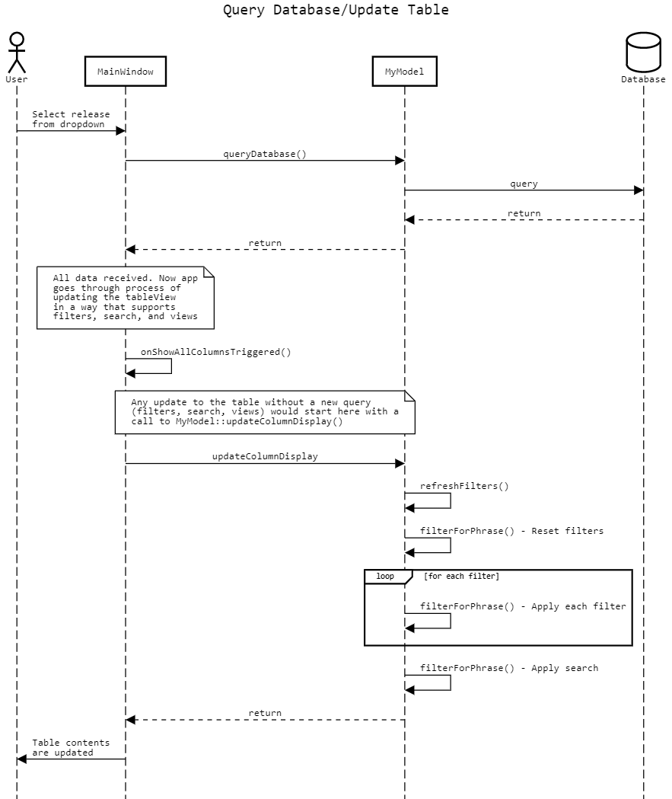

# Fault Manager - Developer Guide

The Fault Manager is used to track 4 categories of data, which are faults, failsafes, interlocks, and system notes, for every software release as well as provide the user with abilities to modify this data for unlocked software releases.

Each major feature of the tool will be highlighted below and the backend process will be explained for each.

## Introduction to the Database
The Fault Manager relies on a MySQL database to store all of the fault, failsafe, interlock, and system note data for each software release. Each release is stored in the database with underscores replacing the dots in the name to conform to SQL syntax requirements (e.g. 4.0.1.0 would be stored as 4_0_1_0). There are 4 tables stored for each release in the database to represent the 4 different categories of data. The category that a specific table belongs to is denoted by the suffix and these suffixes are listed below. The columns associated with each table as well as more information on how to setup the database can be found in the [database_setup.md](database_setup.md) file.
```
Faults: no suffix, only the version name (e.g. 4_0_1_0)
Failsafes: suffix is "_failsafes" (e.g. 4_0_1_0_failsafes)
Interlocks: suffix is "_interlocks" (e.g. 4_0_1_0_interlocks)
System Notes: suffix is "_system_notes" (e.g. 4_0_1_0_system_notes)
```
In addition to the sets of 4 tables for each software release, the database also contains the **releases** table which keeps track of all the release numbers currently being stored in the database as well as whether or not these tables are released. If a table is marked as released in the status column in this table, then options to edit this table through the tool will be disabled. The parent version for each version is also stored which is used to determine which previous version was used as the baseline for any given version.

The last table is the **faultconstants** table which stores enum names for faults as well as what class these enums belong to. This table is used primarily for the FaultConstants.h export option in the tool.

# 1. Making changes to Fault/Failsafe/Interlock/System Note tables

## Adding a New Entry
Clicking the new row button at the bottom of the main page presents a form specific to the category of data currently selected. When this form is filled in by the user and saved, the information is saved to the database through the process below.
    - Each form is a separate page in the QStackedWidget and each form contains the fields from the database as inputs that will be saved to the database when the save button is clicked.

Each category has two major functions in mainwindow.cpp related to saving a new entry which are ``MainWindow::startAdd\[Category\]()`` and ``MainWindow::saveNew\[Category\]()``. 
- The ``MainWindow::startAdd...()`` functions are intended to prompt the user for confirmation about saving the entry as well as an optional reason for why the entry is being added. This reason will get saved to the entry's changelog if provided, otherwise a default message of "Fault Created" is saved along with a timestamp.

- The ``MainWindow::saveNew...()`` functions are where the queries to actually save the entry are generated. These queries are written as QStrings in the form of a MySQL query and are executed using the ``MyModel::execQuery()`` function in ``mymodel.cpp``.
    - The query is given the tablename designated for the current version and category being viewed in the main table and the contents of the relevant fields are added to the query in order.

    - ``MyModel::execQuery()`` calls ``MyModel::execFetch(QSqlQuery *q, QString query, QString dbname)`` which is a function that connects to the database dbname and uses the QSqlQuery object q to execute the query.

After the entry is saved, the main page is displayed and the new entry can be found in the table.

## Viewing an Entry
The intent of the view pages for each category of data is to provide a closer look at the data in the table for one entry. When the user selects an entry and clicks 'View/Edit Row' or double clicks on an entry in the table, the tool takes them to a view page which is an uneditable form containing fields for each piece of data. 

Each field is filled in with the correct values by querying the database using the ``MainWindow::fill\[Category\]Fields()`` functions. These functions map the fields of the result of the query to their corresponding UI elements that need to be filled.

## Editing an Entry
The ability to edit is given to the user when viewing an entry and when the 'Edit' button is pressed, the fields of the form become editable and the save buttons become enabled, allowing the user to make their desired edits and save them to the database as detailed below.

The four main types of fields in the form are QLineEdit, QPlainTextEdit, QComboBox, and QWidgetList. There is also one field that is a QTextBrowser used for the changelog, which the user cannot edit. For each of the four main types of fields, a property called Accessible Name is used to store the name of its corresponding database column making it easy to know what column to store any field's current contents in when executing a query. The process to save is to traverse all of the fields on the given form and use the Accessible Name when executing a query to update the database value to the field's current value.

Traversing and saving each field every time would be inefficient if a majority of the fields never change so to overcome this, there is a highlight feature. There is a dedicated listener for every field on each of the four forms that each call a different version of updateHighlight() based on the category of data. Every time a user enters a letter in a text box or changes the current item in a combo box, an immediate query is executed using the correct ``MainWindow::updateHighlight\[category\]()`` function and the field is highlighted yellow if the new contents do not match what has been saved in the database. The background role of the field is also set to Qt::Highlight which saves time when traversing all the fields because we will only save the contents of the fields that are currently in the Qt::Highlight background role. The highlights and background role are removed when the field's contents match the contents in the database.
```
updateHighlightLE(), updateHighlightPT(), updateHighlightCB()
```
When the user presses save, they are greeted with a confirmation prompt that lists out all of the changes that were made in the edit using the ``MainWindow::setChangesBrowser()`` function. This is possible using the Accessible Description property of all the fields in the form. For each entry that is being saved, there is a line following the format '\[Accessible Name\] changed to \[field's current text\]'. The user can also enter a reason for the edit in this prompt which will be saved in the changelog.

Pressing save on the confirmation will save the changes in the database and display the main page with the edits being found in the table.

# 2. Software Releases

## Creating a New Release
The user is able to create a new software release which will inherit its data from a previous release that is specified in a combobox. When the 'Create Release' button is clicked, the name of the new release and the name of the parent release is passed into MyModel::createNewRelease() that follows the below process.
- Create new tables for the new release with the correct names and columns
- Query data from parent release and store in a vector which will be used to insert the data into the new tables
    - Note: data is cleansed of tabs to follow SQL syntax requirements so all tabs are converted to "'" before inserting into the database and then converted back to tabs after
- Create new entry in releases table for new release and set it to 'working' and set the parent to be the name of the parent release

After the release is created, it will become visible in the releases dropdown on the homepage.

## Locking and Unlocking a Release
Locking a release is intended to prevent any further changes to the release by ghosting the buttons for adding new faults and editing existing faults. Thus, the user is unable to make any changes to the database when looking at a locked release. When the user selects the 'Lock Current' option in the releases menu, the status of current release's corresponding entry in the releases table gets updated to say 'released' which the tool uses to know when to ghost the correct buttons.

To unlock a release, the user must enter the correct password. The **password to unlock a release is currently "editfaults"** and is stored as a hash in mainwindow.h. Unlocking the release changes the status in the releases table back to 'working' and the buttons that were previously ghosted are now enabled, allowing the user to make changes to the database.

## Deleting a Release
To delete a release, the deleteRelease() function is called which drops all of the tables related to the current release from the database. The corresponding entry in the releases table is also removed after returning the parent associated with the current release. This parent is the table displayed on the main screen after deletion. If there are no more tables left, then an empty table is displayed and the message "No tables left to display" is printed in the console.

## Renaming a Release
To rename a release, both MainWindow::deleteRelease() and myModel::createNewRelease() are used. First, createNewRelease() is called and the data in the tables associated with the old release name is copied. The new tables are created using the new release name and the entry is added to the releases table. Then, deleteRelease() is called on the old release name so that the old tables are now deleted and the new release tables are left. This effectively serves as renaming a release.

# 3. Managing The Contents of the QTableView
The ``MyModel`` class is the model behind the ``QTableView`` displayed on the main page of the application. The ``MainWindow`` object holds a single instance of the ``MyModel`` class called ``myModel``. It is primarily responsible for managing the data behind the table, but it also serves many other purposes.

## ``MyModel`` Significant Class Fields
#### ``const MyModel::QMap<QString, QMap<QString, QStringList>> columnMap``
Stores information about the fields for all 4 categories of items in the tool. The outermost level is what type of entries you want ("header_name", "database_name", or "database_type"). The inner level is what category of items you want, formatted nicely so it can be displayed as is ("WCAs", "Failsafes", "Interlocks", "System Notes"). And lastly, the innermost string list is a list of strings containing what you're looking for. For example, if you wanted to get a list of formatted column names for interlocks, you could access it like this:
```
myModel->columnMap.value("header_name").value("Interlocks")
```
**Note: the order of the entries in the ``QStringList``s is the same as the order in the database. That assumption is relied upon in several parts of our code so make sure it is maintained like that**

#### ``QSettings * settings``
Pointer to ``QSettings`` object used to save settings locally to the user's computer. It is configured in the ``MyModel`` constructor with the following options:
- ini format
- user scope
- Organization: "Textron Systems"
- Application: "Fault Manager"

This means that the ini file will be saved as ``"C:\Users\[username]\AppData\Roaming\Textron Systems\Fault Manager.ini"``. The applicatoin installer deletes this file when uninstalling.

The application looks to this file on startup for the database hostname, username, and password and will prompt for them if it can't find them. The only other setting needed to connect to the database is the database name which is non-configurable by the user and set as a class constant in ``MainWindow``. It should always be "fmtooldb" unless a different database name is used when the database is set up.

On startup the application also looks for the previous release and category and opens displaying that release and category if found. If not found, the application opens a default release and category. On application close, the release and category currently being viewed are saved to these variables for the next startup.

Lastly, the application stores any saved views here and looks at this file for the information about what views are currently saved. More about how that works is below in the "Storing Views" section.

#### ``std::map<QAction *, QMap<QString, bool>> viewMap``
Stores all information about the saved views that apply to the category of item currently being viewed (visible in the "View" menu). It is populated by the ``MainWindow`` as it reads the settings file and fills the "View" menu. The key is a pointer to the menu bar opton for that view and the value is a map of column names to if they are displayed in the view. It is read by ``myModel`` to determine what should be shown on the table if a view is selected.

#### ``QMap<QString, QString> filters``
Stores all the filters currently applied. The key is the column name and the value is the text string to filter for.

#### ``QString ** fullcelldata``
Stores the data from the database that is returned for the currently selected release and category. This two dimentional array is populated after the query returns with the full table data and it is not changed until the next time the user changes the selected release or category and another query runs.

#### ``QString ** celldata``
Stores the data actually displayed on the table. Without any filters, views, or search text, this two dimentional array will be exactly the same as ``fullcelldata``, but when any of those are applied it deviates from ``fullcelldata`` because what is displayed on the main page table is not the full table returned from the database.

#### ``bool ** cellbackgrounds``
Stores whether each cell being displayed is highlighted with a yellow background or not. Used to highlight cells containing the search term for searches. Because it correlates to displayed cells, it will always be the same size as ``celldata``.

#### ``bool ** cellused``
Stores whether each cell being displayed is highlighted with a light gray background or not. Used to slightly gray out cells that are empty. Because it correlates to displayed cells, it will always be the same size as ``celldata``.

#### ``QString * headerdata``
Stores the formatted column names that are being displayed in the header. Resizes to match the number of columns in ``celldata``.

#### ``int fullrows``
The number of rows in the fullcelldata array

#### ``int fullcolumns``
The number of columns in the fullcelldata array

#### ``int rows``
The number of rows in the celldata array. Also the number of rows currently being displayed in the table.

#### ``int columns``
The number of columns in the celldata array. Also the number of columns currently being displayed in the table.

## Filtering/Searching
One of the main pieces of functionality that ``myModel`` is responsible for is filtering the contents of the table based on three possible things:
- Filters
- Search
- Views

Because any number of these could be applied at any time during use of the tool, every update to the table kicks off a common process that removes and re-applies all parts (with a call to ``MyModel::updateColumnDisplay()``). For example, when adding a filter, the model will first restore all rows to the table that may have been previously filtered, then apply each filter one after the other including the new one just added, then apply the search term if preset, and all the while only keeping columns that are displayed in the current view. This is the reason that all changes to filters, search, or views in the ``MainWindow`` code are followed by a call to ``MyModel::updateColumnDisplay()``.

## Querying The Database
The ``myModel`` class contains many queries to the database in many places that serve different functions like getting a list of stored releases or updating information about an item. But the main query is the ``SELECT`` query that gets sent to populate the table every time a combo box is changed. This query is sent the same way whether either combo box is changed because they both change the table that should be displayed on the main page. This query is special in that it is the only time when the contents of the table are changed outside of the filtering/searching functionality. The function is called ``MyModel::queryDatabase()`` and will populate the table with the full, unfiltered, table from the database and return.

After returning from the ``MyModel::queryDatabase()`` function, the ``MainWindow`` then goes through the same process it would go through when the "Show All Columns" button is selected, leading it through the entire filtering/searching process described above. This combination of query database, then refresh the filters/search is shown in the sequence diagram below.



## Storing Views
Views are made up of a list of columns and whether they are displayed or not. Because the columns change between categories of items, a view is only applicable to a single category of item, and a user will save different views for the different categories of items. A saved view for one category will not be displayed if a different category of item is currently selected and being displayed in the table.

In the settings, a view is saved as a list of values named ``views/[view name]/[column name]`` that can be either "true" or "false". Every view will have a value saved for all columns in the database for the category for which it was made for. This is what the model uses for loading in views to its ``viewMap``, but it does not account for users who don't have a saved view selected and instead have some custom configuration of columns displayed.

To solve this problem, the ``MainWindow`` class has a function called ``MainWindow::getCustomView()`` that simply looks at the list of columns in the "Select Columns" sub-menu and records if each one is currently displayed. This method will always get the current view whether it has been loaded from settings or set up manually. This is the function used to get the view passed in all the calls to ``MyModel::updateColumnDisplay()`` mentioned above.

## Adjusting table size
The size of the displayed table could change for many different reasons like, for example, any of the filter/search functions being applied. The ``myModel`` class manages the data in the table, and therefore must communicate with the ``QTableView`` whenever the table size changes. Aditionally, because the table data, unused cell data, and cell background color data are all stored as two dimentional arrays, they must be properly deleted to avoid memory leaks.

For this reason, the ``MyModel::adjustTableSize()`` function fully handles the resize of the table, making sure to not break anything or create any memory leaks. It determines whether it needs to add or remove both rows and columns to fit the new dimentions, then calls the correct ``insert[rows/columns]()`` and/or ``delete[rows/columns]()`` function to do those resizes accordingly. Each of those functions handles properly resetting the following class fields:
- ``headerdata``        - Redeclared as the correct size, not populated
- ``cellbackgrounds``   - Redeclared as the correct size, not populated
- ``cellused``          - Redeclared as the correct size, not populated
- ``celldata``          - Redeclared as the correct size, not populated
- ``rows``              - Updated to proper value
- ``columns``           - Updated to proper value

**Note: no update to ``fullcelldata``, ``fullrows``, or ``fullcolumns`` because the only thing that changes those is the ``MyModel::queryDatabase()`` function which runs after the user changes either combo box**

# 4. Maintaining the Database

## Backing up the Database
The easiest way to back up the entire database is to use the mysqldump feature and create a single .sql file containing the entire database. To do this, use the following command (assuming mysqldump.exe is on your path):

```
mysqldump -u [username] -p [name_of_database] > [new_backup_name].sql
```
A file called [backup name].sql will be created where the command was called containing everything currently in the database. To restore the database to a specific backup file, simply run the command with "<" indicating a restore instead of a backup. Example:

```
mysqldump -u [username] -p [name_of_database] < [exisitng_backup_name].sql
```
**Note: Although we don't know why, we were not able to run the backup command remotely and instead only were able to run it on the machine that hosts the database. Further investigation may be needed if running it remotely is necessary. If running remotely, a -h [hostname] option would need to be added to the commands**

## Procedure when Editing/Removing/Adding New Columns to the MySQL Database
Follow these steps when adding new columns or editing/removing old columns to ensure that the code is able to correctly use the database.

1. If necessary, add UI element for new column to the view page and give the element an Accessible Name corresponding to the database column name, provide appropriate text for Accessible Description and Object Name
2. Modify columns in the database and update the relevant \[category\]fields enum in ``mainwindow.cpp``
3. Update relevant ``dbcolumns const int`` at the top of ``mainwindow.cpp`` which stores the number of total columns
4. Update relevant ``fill\[Category\]Fields()`` function in ``mainwindow.cpp``
5. Update ``columnMap`` in ``mymodel.h``
6. Create listeners for new fields on the view page which call the relevant ``updateHighlight()`` function in ``mainwindow.cpp``
7. Update relevant ``saveNew\[Category\]()`` function in ``mainwindow.cpp`` to ensure that every field is being saved to the database
